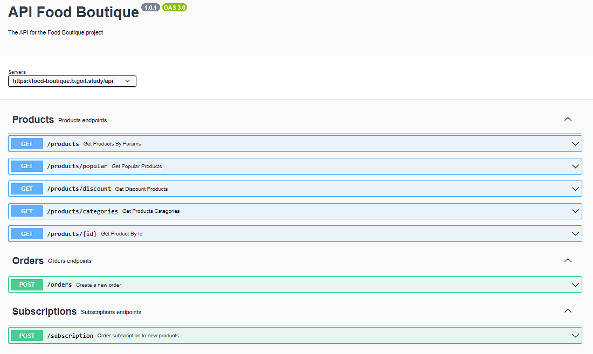

**Читати іншою мовою: [Англійська](README.md).**

# Веб додаток "Food Boutique"

Проект представляє собою веб-додаток для інтернет-магазину продуктів, який надає
користувачам можливість переглядати різноманітні продукти, фільтрувати їх за
категоріями і ключовими словами, оформляти замовлення і підписуватися на
розсилку нових продуктів.

Посилання на розгорнутий фронтенд
[]

## Зміст

- [Використані технології](#використані-технології)
- [Наша команда](#наша-команда)
- [Документація API](#документація-api)
- [Вимоги](#вимоги)
- [Інсталяція](#інсталяція)
- [Конфігурація](#конфігурація)
- [Команди сервера](#команди-сервера)

## Огляд проекту

Проект використовує API для отримання даних про продукти, категорії, популярні
продукти, знижки, оформлення замовлень і підписки на розсилку. Користувачі
можуть переглядати продукти, додавати їх до кошика, оформляти замовлення і
отримувати новини про нові продукти.

## Використані технології

- Vite: Сучасний збірник та інструмент для розробки.
- Axios: HTTP-клієнт для виконання запитів.
- Choices.js: Бібліотека для покращення полів вибору.
- Lodash: Утиліти для роботи з масивами, об'єктами та функціями.
- Lodash.throttle: Функція для обмеження частоти виклику.
- Modern-normalize: Сучасна нормалізація стилів для браузерів.
- Notiflix: Бібліотека для сповіщень і спіннерів.
- TUI Pagination: Плагін для пагінації.
- Vite-plugin-full-reload: Плагін для повної перезагрузки при зміні файлів.
- Vite-plugin-html-inject: Плагін для вбудовування HTML у проект Vite.

## Наша команда

1. **Сафонов Сергій** - `team-lead`,`розробник`

   <a href="https://github.com/KaratSergio">git-hub профіль</a>

2. **Дмитро Броніцький** - `scrum-master`,`розробник`

   <a href="https://github.com/DimaBronytskyy">git-hub профіль</a>

3. **Сергій Буша** - `розробник`

<a href="https://github.com/rango198">git-hub профіль</a>

4. **Анатолій Білик** - `розробник`

<a href="https://github.com/BizonNT">git-hub профіль</a>

5. **Анастасія Родзіна** - `розробник`

   <a href="https://github.com/Anastasiia-Rodzina">git-hub профіль</a>

6. **Олександра Кошиль** - `розробник`

   <a href="https://github.com/sashasashkina">git-hub профіль</a>

7. **Наталія Потушинська** - `розробник`

   <a href="https://github.com/NataliaPot">git-hub профіль</a>

8. **Анна Войтцеховська** - `розробник`

   <a href="https://github.com/Anna4voit">git-hub профіль</a>

9. **Олег Тимошенко** - `розробник`

   <a href="https://github.com/djurik2008">git-hub профіль</a>

10. **Микола Мицик** - `розробник`

    <a href="https://github.com/mykolamytsyk">git-hub профіль</a>

11. **Олександр Шкляр** - `розробник`

    <a href="https://github.com/Alex11SW">git-hub профіль</a>

## Документація API

Для детальних описів запитів та взаємодій з API перегляньте
[документацію Food Boutique](https://food-boutique.b.goit.study/api-docs/)

## Вимоги

Перед початком роботи з проектом переконайтеся, що у вас встановлені наступні
інструменти на вашому комп'ютері:

- Node.js (версія 18 або вище)

## Інсталяція

1. Склонуйте цей репозиторій на свій локальний комп'ютер.
2. Відкрийте термінал і перейдіть до кореневої теки проекту.
3. Запустіть команду `npm install` проекту.

## Конфігурація

1. Створіть файл .env у кореневій теці проекту, виходячи з файлу .env.example.
2. Вкажіть необхідні змінні середовища в цьому файлі.

## Команди сервера

**npm:**

- `npm run dev` — Запустити сервер у режимі розробки.
